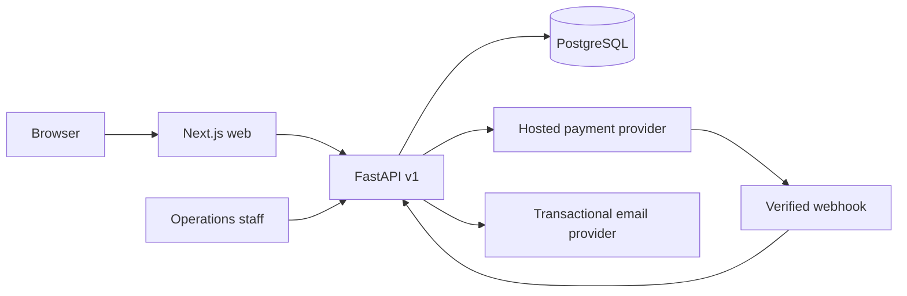

# brew67potions implementation architecture

This document records implementation choices for the September 2026 POC and PDD. The source DOCX and PDF remain the product baseline. Code must preserve the source document's distinction between a concept experience and a legally approved sale.

## Decisions

| Area | Decision | Reason |
| --- | --- | --- |
| Web | Next.js 16 App Router and TypeScript | Accessible server-rendered discovery with small client components for interactive flows. |
| API | FastAPI with Pydantic contracts | Explicit versioned HTTP boundary and deterministic domain services. |
| Data | PostgreSQL 17, SQLAlchemy 2, Alembic | Transactional records, constraints, and audited migrations. SQLite is permitted only for isolated tests. |
| Payments | Hosted Stripe Checkout behind a disabled-by-default release gate | Keeps card data outside the application. Sale remains unavailable until product, legal, tax, and operations approvals are recorded. |
| Media | Local SVG/CSS visual system in the POC, object storage when approved assets exist | Avoids false product imagery and unnecessary third-party scripts. |
| Recommendations | Versioned, deterministic rules | Every result is reproducible and includes rationale and limitations. |
| Impact | No numerical claim without approved factors | Modeled estimates require source, baseline, boundary, unit, methodology version, and qualification. |
| Geography | United States only for the initial commerce configuration | Tax and shipping expansion requires a separate release review. |

## Service boundaries

The web server fetches public catalog data from the API. Browser mutations use the same-origin `/api/v1` proxy. The API owns validation, pricing, inventory, consent, orders, and audit records. No browser-provided price, role, stock count, or payment state is authoritative.

## Release gates

All seed products have `concept` availability and may appear in a clearly labeled simulated cart. The API must reject payment checkout for a product unless its formulation, safety document, usage directions, labeling, price, inventory, shipping, tax, and claims have approved records. The default `COMMERCE_ENABLED=false` gate also blocks checkout globally. A reviewer must verify the evidence and operational prerequisites before changing that configuration.

## API and data conventions

- Public API prefix: `/api/v1`.
- All money uses integer minor units and ISO 4217 currency codes.
- Product slugs and brew numbers are unique. Public responses exclude unapproved claims.
- Every recommendation includes a rule set version, echoed inputs, rationale, assumptions, and warnings.
- Material admin changes require an actor and reason and append an audit event.
- Analytics events use an allowlist of properties and anonymous identifiers. Email and payment data are prohibited in event payloads.
- Intent signups use explicit consent fields and store a consent timestamp and policy version.

## Operational notes

Local development starts PostgreSQL with `docker compose up -d db`, applies Alembic migrations, seeds the concept catalog, starts FastAPI on port 8000, and starts Next.js on port 3000. Production must use separate credentials, managed secrets, encrypted backups, request and error monitoring, a tested restore, and a reviewed incident runbook.
