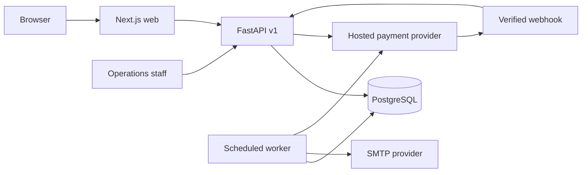

# brew67potions implementation architecture

This document records the original September 2026 POC and PDD implementation. The current public website is a static, informational concept site built from `apps/web`; it does not call the API or use a database. The FastAPI and commerce code remain in the repository as prior POC work and are not part of the public deployment. See [deployment-vercel.md](deployment-vercel.md) for the current hosting path.

## Decisions

| Area | Decision | Reason |
| --- | --- | --- |
| Web | Next.js 16 App Router and TypeScript | Accessible server-rendered discovery with small client components for interactive flows. |
| API | FastAPI with Pydantic contracts | Explicit versioned HTTP boundary and deterministic domain services. |
| Data | PostgreSQL 17, SQLAlchemy 2, Alembic | Transactional records, constraints, and audited migrations. SQLite is permitted only for isolated tests. |
| Payments | Hosted Stripe Checkout behind a disabled-by-default release gate | Keeps card data outside the application. Sale remains unavailable until product, legal, tax, and operations approvals are recorded. |
| Media | Local SVG/CSS visual system in the POC, object storage when approved assets exist | Avoids false product imagery and unnecessary third-party scripts. |
| Recommendations | Versioned, deterministic rules | Every result is reproducible and includes rationale and limitations. |
| Impact | No numerical claim without approved factors | Modeled estimates require source, baseline, boundary, unit, methodology version, and qualification. |
| Geography | United States only for the initial commerce configuration | Tax and shipping expansion requires a separate release review. |
| Identity | Argon2 password hashes, hashed database sessions, Secure/HttpOnly cookies and CSRF token | Accounts and staff roles are server owned. Production uses HTTPS and no shared admin key. |
| Transactional email | Database outbox and scheduled SMTP worker | Registration, recovery and order email survive API restarts and can be retried. |
| Subscriptions | Stripe subscription Checkout and portal, invoice driven refill orders | A paid renewal creates one order per invoice; unavailable stock goes to a visible hold for later allocation. |
| Privacy requests | Self export, password confirmed deletion request, audited redaction | Active obligations block deletion; external provider follow-up requires separate evidence. |
| Abuse controls | Database-backed fixed-window rate limits | Limits public submissions, account entry points, and checkout consistently across API workers. |
| Build inputs | Hashed API runtime lock and pnpm lock | Makes container dependency resolution repeatable and auditable in CI. |

## Service boundaries

The web server fetches public catalog data from the API. Browser mutations use the same-origin `/api/v1` proxy. The API owns validation, pricing, inventory, consent, orders, and audit records. No browser-provided price, role, stock count, or payment state is authoritative.

The order state machine starts with a stock reservation. A hosted Checkout session either confirms payment through a signed, idempotent webhook or expires and releases the reservation. Subscription invoices create separate orders and decrement available stock only once. A paid invoice without stock is retained as a stock hold and must be allocated before fulfillment. Refunds are keyed by an internal record and reconciled from provider events. Price and formulation snapshots remain on each order item.

## Release gates

All seed products have `concept` availability and may appear in a clearly labeled simulated cart. The API must reject payment checkout for a product unless its formulation, safety document, usage directions, labeling, price, inventory, shipping, tax, and claims have approved records. The default `COMMERCE_ENABLED=false` gate also blocks checkout globally. A reviewer must verify the evidence and operational prerequisites before changing that configuration.

In any nonlocal environment, `COMMERCE_ENABLED=true` is insufficient by itself. Checkout additionally requires a launch approval reference, public support address, HTTPS terms and refund links, HTTPS web URL, Stripe credentials and shipping rate, and operational email configuration. Product publication rechecks the same product gates and rejects placeholder concept copy.

## API and data conventions

- Public API prefix: `/api/v1`.
- All money uses integer minor units and ISO 4217 currency codes.
- Product slugs and brew numbers are unique. Public responses exclude unapproved claims.
- Every recommendation includes a rule set version, echoed inputs, rationale, assumptions, and warnings.
- Material admin changes require a role, CSRF token, reason and append an audit event. The POC admin key works only outside production.
- Analytics events use an allowlist of properties and anonymous identifiers. Email and payment data are prohibited in event payloads.
- Intent signups use explicit consent fields and store a consent timestamp and policy version.
- Request telemetry records route templates, status, latency and a request ID without URLs, bodies, or query strings; private API responses use `Cache-Control: no-store`.

## Operational notes

Local development starts PostgreSQL with `docker compose up -d db`, applies Alembic migrations, seeds the concept catalog, starts FastAPI on port 8000, and starts Next.js on port 3000. Production must use separate credentials, managed secrets, encrypted backups, request and error monitoring, a tested restore, and a reviewed incident runbook.

See [commerce-runbook.md](commerce-runbook.md) for the scheduler, payment events, release sequence, privacy workflow, and recovery procedure. `compose.full.yaml` exercises the container topology locally; it is not a production manifest. The source POC/PDD remains unchanged because these are implementation decisions and do not alter its product requirements.
